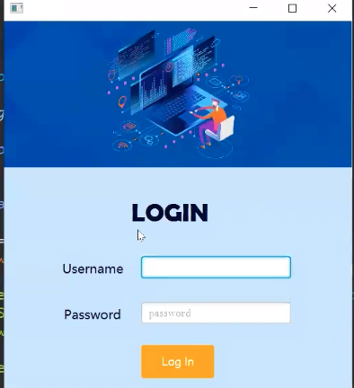
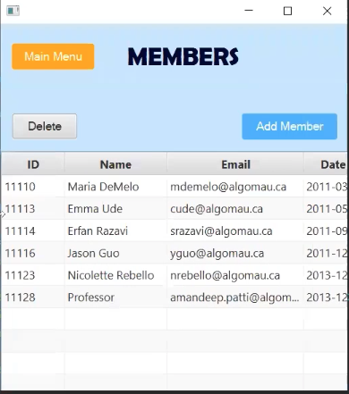
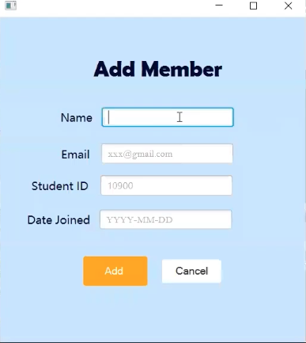
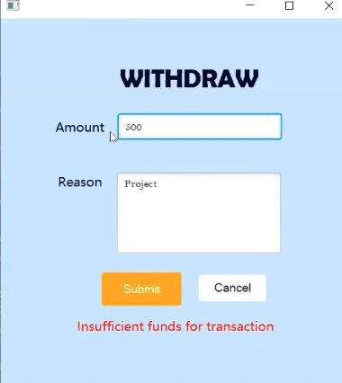
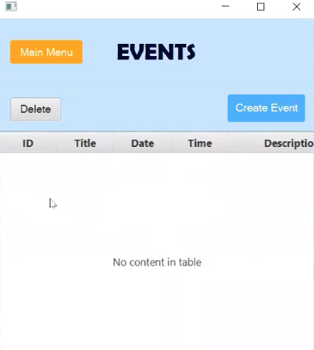
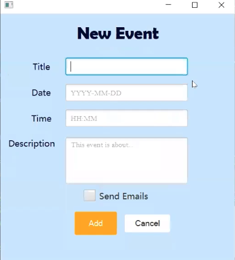

COSC Club Event Management System

The CCMT is a software that allows for better management of a club. Currently it is extremely hard for the organizers to keep track of events, memberships and the financial information. The application to be created is meant to organize and facilitate the leaders with a better management tool which consequently decreases potential errors. The software product being created is a new, self-contained product. 

**Tools:** Java, Javafx

**Database:** Mysql

**Documentations:**

